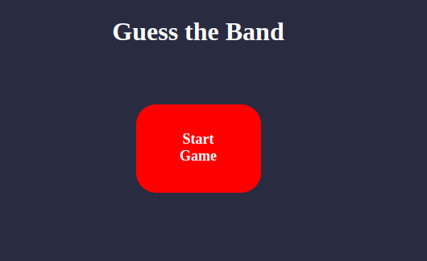
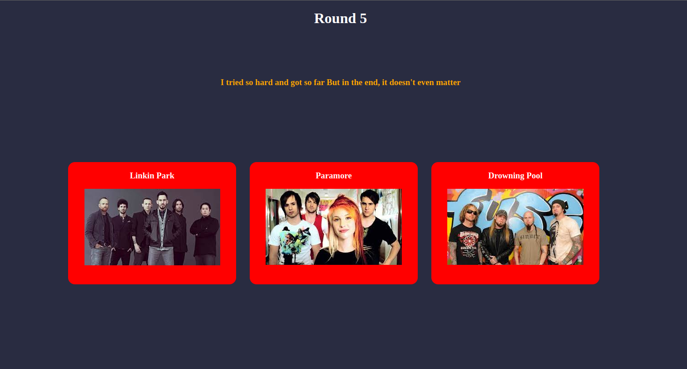
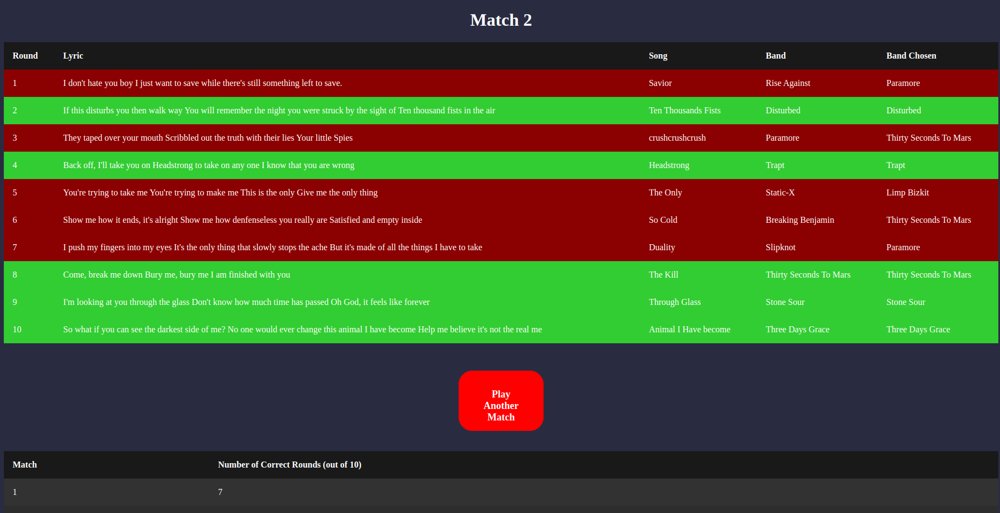

# Guess the Band

The reason why I am making this project is to understand the front-end topics. This includes using HTML, CSS, and JavaScript to make a good looking and interactive website that hosts a game. Guess the Band is a 10 round game where you are given Lyrics from a popular rock song in the 2000's and you have to guess the band that played those lyrics from three options. There are a total of 28 different lyrics that can appear and there are no duplicates in lyrics on a match. A feature that my game has is that it will store your results from your previous matches.

## How to use

Just download all the files in this github project, find an extension to run a live server for the files, and enjoy.
